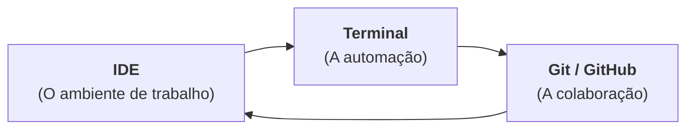

Elizabet Medeiros / Fabián Abarca

<span class="text-sm">
Centro de Informática <br>
Universidade Federal da Paraíba <br>
Julho de 2026
</span>

---
layout: columns
title: Onde Estamos e Para Onde Vamos?
columns:
  - {
      title: "O que já fazemos",
      items:
        [
          "Jupyter Notebooks para análise exploratória de dados.",
          "Manipulação de tabelas de processo com Pandas.",
          "Estatística básica aplicada a controle de qualidade.",
        ],
    }
  - {
      title: "O desafio",
      items:
        [
          "Como transformar esses códigos em sistemas automatizados?",
          "Como trabalhar em equipe em plantas industriais ou centros de pesquisa?",
          "Como garantir que o código rode em qualquer computador?",
        ],
    }
---

---
layout: diagram
kicker: Uma Estrutura Básica
title: Ecossistema Profissional
note: Tem muitas ferramentas, mas podemos organizar em três grandes blocos de desenvolvimento.
---



---
layout: section
kicker: CLI (Command Line Interface)
title: O Terminal de Comandos
---

Controlando o computador sem precisar da interface gráfica.

O que é? Uma interface em texto direto com o sistema operacional.

---
layout: columns
title: O Terminal de Comandos
columns:
  - {
      title: "Por que engenheiros usam?",
      items:
        [
          "Rapidez para executar tarefas repetitivas.",
          "Permite rodar scripts em servidores remotos ou na nuvem (sem monitor).",
          "Consome muito menos memória RAM que interfaces visuais.",
        ],
    }
  - {
      title: "Com um grande poder vem uma grande responsabilidade",
      items:
        [
          "Comandos mal utilizados podem apagar arquivos importantes.",
          "É preciso atenção redobrada ao digitar comandos.",
          "Sempre verifique o que está prestes a executar antes de apertar Enter.",
        ],
    }
---

---
layout: reference
title: Comandos do Terminal
groups:
  - {
      title: Essenciais,
      items:
        [
          { term: "cd", desc: "Navegar entre pastas" },
          { term: "ls", desc: "Listar arquivos" },
          { term: "pwd", desc: "Mostrar o caminho da pasta atual" },
          { term: "python", desc: "Executar Python interactivamente" },
        ],
    }
  - {
      title: Úteis,
      items:
        [
          { term: "mkdir", desc: "Criar uma nova pasta" },
          { term: "rm", desc: "Apagar arquivos ou pastas" },
          { term: "mv", desc: "Mover ou renomear arquivos" },
          { term: "cp", desc: "Copiar arquivos" },
        ],
    }
---

---
layout: section
kicker: IDE (Integrated Development Environment)
title: O Editor de Código
---

Onde o código de verdade ganha vida.

---
layout: columns
title: O Editor de Código
columns:
  - {
      title: "O que é uma IDE?",
      items:
        [
          "Um programa feito sob medida para escrever, testar e depurar código.",
          "Possui recursos como destaque de sintaxe, autocompletar e integração com sistemas de controle de versão.",
          "Permite organizar projetos complexos com múltiplos arquivos e dependências.",
        ],
    }
  - {
      title: "Vantagens em relação ao notebook",
      items:
        [
          "Realce de sintaxe e autocompletar inteligente (IntelliSense).",
          "Detecção de erros antes mesmo de rodar o programa.",
          "Integração nativa com o terminal e com o Git.",
          "Refatoração fácil de arquivos grandes.",
        ],
    }
---

---
layout: section
kicker: Para rodar em qualquer computador
title: Ambientes Virtuais e Dependências
---

"Na minha máquina funciona... e na sua?"

---
layout: columns
title: Ambientes Virtuais e Dependências
columns:
  - {
      title: "O Problema",
      items:
        [
          "A sua simulação usa Pandas versão 2.0, mas o computador do laboratório usa a versão 1.0 e o código quebra.",
          "O seu código depende de uma biblioteca que não está instalada no computador do colega de equipe.",
          "Você quer rodar o mesmo código em um servidor remoto, mas não sabe se todas as dependências estão instaladas.",
        ],
    }
  - {
      title: "A Solução",
      items:
        [
          "Use ambientes virtuais para isolar dependências.",
          "Liste todas as bibliotecas necessárias em <code>requirements.txt</code> ou <code>pyproject.toml</code>.",
          "Garanta que todos os membros da equipe usem as mesmas versões.",
        ],
    }
---

---
layout: section
kicker: Git e GitHub
title: Controle de Versão
---

"Chega de `analise_v1.py`, `analise_v2_final.py`, `analise_OFICIAL.py`, `analise_final_mesmo.py`!"

---
layout: columns
title: Controle de Versão
columns:
  - {
      title: "Git (O Histórico)",
      items:
        [
          "Funciona como uma 'máquina do tempo' para o seu código.",
          "Permite voltar a qualquer ponto do passado se algo quebrar.",
          "Facilita o trabalho em equipe, evitando conflitos de código.",
        ],
    }
  - {
      title: "GitHub (A Nuvem / Rede Social)",
      items:
        [
          "Onde você guarda seus repositórios remotos.",
          "Facilita a colaboração entre equipes de engenharia.",
          "Serve como seu portfólio profissional para o mercado de trabalho.",
        ],
    }
---

---
layout: steps
kicker: O Fluxo Profissional
title: Como Tudo se Conecta
steps:
  - {
      title: Protótipo (Jupyter Notebook),
      desc: Você explora os dados de um reator e testa hipóteses de forma rápida.,
      icon: "lucide:book-open",
    }
  - {
      title: Estruturação (IDE + .py),
      desc: "Você limpa o código, cria funções modulares e salva em arquivos .py no VS Code.",
      icon: "lucide:code",
    }
  - {
      title: Isolamento (Terminal + venv),
      desc: Você garante que todas as bibliotecas estão salvas no requirements.txt ou pyproject.toml.,
      icon: "lucide:package",
    }
  - {
      title: Publicação (Git & GitHub),
      desc: Você envia as alterações para o repositório da fábrica para que sua equipe possa usar.,
      icon: "lucide:cloud-upload",
    }
---

---
layout: default
kicker: Conclusão
title: Próximos Passos
---

- Domine o básico do VS Code e do Terminal.
- Crie sua conta no GitHub e comece a subir seus projetos da faculdade.

---
layout: quote
quote: O diferencial de um engenheiro químico moderno não é apenas saber a teoria, mas saber transformar equações em ferramentas automatizadas e reprodutíveis.
author: Professora Elizabet (ou professor Fabián, não sei)
---

---
layout: section
title: Exemplo com GitHub Codespaces
---

---
layout: steps
kicker: GitHub Codespaces
title: Como Começar
steps:
  - {
      title: Repositório,
      desc: "Abra o repositório de exemplo.",
      icon: "lucide:folder",
    }
  - {
      title: Fork,
      desc: "Faça um fork do repositório para sua conta.",
      icon: "lucide:git-fork",
    }
  - {
      title: Codespace,
      desc: "Abra o repositório em um GitHub Codespace.",
      icon: "lucide:cloud",
    }
  - {
      title: Programar!,
      desc: "Comece a programar diretamente no Codespace.",
      icon: "lucide:code",
    }
---

---
layout: two-cols
kicker: Monitoramento de reator químico
title: O Repositório de Exemplo
---

## Estrutura de arquivos

<br>

<FileTree :items="[{name:'data', children:[{name:'process.csv'}]}, {name:'images', children:[{name:'...'}]}, {name:'.gitignore'}, {name:'pyproject.toml'}, {name:'main.py'}, {name:'README.md'}]" />

::right::

## Como criar o codespace para rodar na nuvem

Dar uma olhada no `README.md` do repositório para instruções de como criar o Codespace e rodar o código de exemplo.

## Como rodar o código localmente

Opcionalmente, você pode **clonar** o repositório e rodar o código localmente. Depois de instalar o Python, `uv`, Git e um IDE (como o VS Code):

```bash
git clone https://github.com/improbabilidades/monitoramento-reator.git
```

<Callout tone="info" icon="lucide:download">
Instruções para <a href="https://docs.astral.sh/uv/">instalar uv</a>.
</Callout>

---
layout: section
title: Big Data e Bases de Dados
---

---
layout: code-explain
kicker: SQL — Quando o código precisa falar com um banco de dados
title: As Cinco Vs do Big Data
notes:
  - "<strong>Volume</strong> — Muitos dados."
  - "<strong>Variedade</strong> — Diferentes tipos de dados."
  - "<strong>Velocidade</strong> — A rapidez com que chegam."
  - "<strong>Veracidade</strong> — A qualidade e confiabilidade."
  - "<strong>Valor</strong> — A utilidade."
---

```sql
SELECT
  reactor_id,
  DATE_TRUNC('hour', measured_at) AS hora,
  AVG(temperature_c) AS temp_media_c,
  AVG(pressure_bar) AS pressao_media_bar
FROM reactor_sensor_data
WHERE reactor_id = 'R-101'
  AND measured_at >= NOW() - INTERVAL '24 hours'
GROUP BY reactor_id, DATE_TRUNC('hour', measured_at)
ORDER BY hora;
```

---


---

